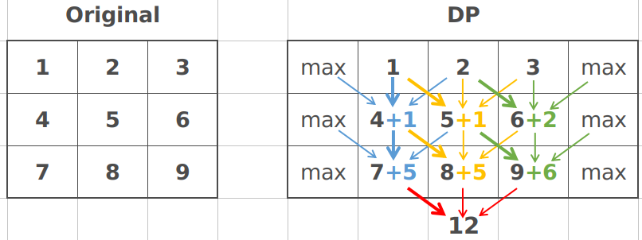

[931. Minimum Falling Path Sum](https://leetcode.com/problems/minimum-falling-path-sum/)




```java
public int minFallingPathSum(int[][] A) {
    int rows = A.length, cols = A[0].length;
    int[][] dp = new int[rows][cols + 2];
    for(int i = 1; i <= cols; i++)
        dp[0][i] = A[0][i - 1];
    for(int i = 0; i < rows; i++){ //dp[][]的最后一行不用赋值
        dp[i][0] = Integer.MAX_VALUE;
        dp[i][cols + 1] = Integer.MAX_VALUE;
    }
    for(int i = 1; i < rows; i++){//dp[][]的最后一行不用赋值
        for(int j = 1; j <= cols; j++){
            dp[i][j] = A[i][j - 1] + Math.min(Math.min(dp[i - 1][j - 1], dp[i - 1][j]), dp[i - 1][j + 1]);
        }
    }
    int res = Integer.MAX_VALUE;
    for(int i = 1; i <= cols; i++)
        res = Math.min(res, dp[rows - 1][i]);
    return res;
}
```

